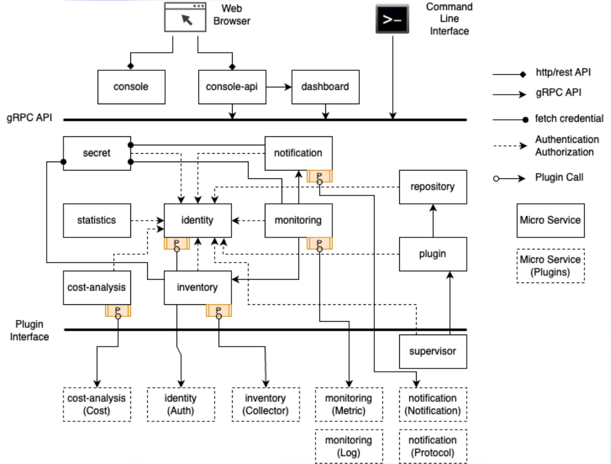
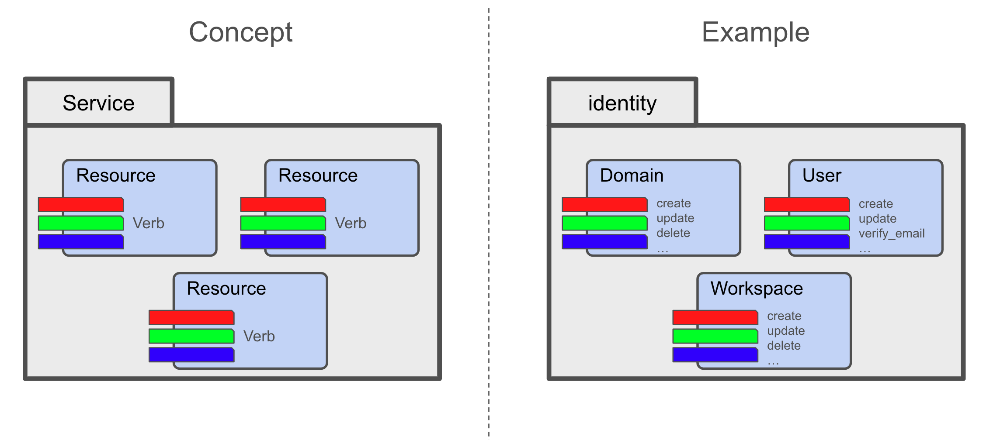

## Micro Service Architecture

Cloudforet adopts a microservice architecture to provide a scalable and flexible platform. The microservice architecture is a design pattern that structures an application as a collection of loosely coupled services. Each service is self-contained and implements a single business capability. The services communicate with each other through well-defined APIs. This architecture allows each service to be developed, deployed, and scaled independently.

The frontend is a service provided for web users, featuring components such as console and console-api that communicate directly with the web browser. The core logic is structured as independent microservices and operates based on gRPC to ensure high-performance and reliable communication.

Each core logic can be extended by plugin services. Every plugins are developed and deployed independently, and they can be added, removed or upgraded without affecting the core logic.

## API-Driven design

API-Driven design in microservice architecture is a pattern where APIs (Application Programming Interfaces) are the primary way that services interact and communicate with each other. This approach emphasizes the design of robust, well-defined, and consistent APIs that serve as the contracts between microservices. Here’s a detailed explanation of the API-Driven design pattern:

### gRPC as the Communication Protocol

gRPC is a high-performance, open-source, universal RPC (Remote Procedure Call) framework that is widely used in microservice architectures. It uses HTTP/2 as the transport protocol and Protocol Buffers (protobuf) as the interface definition language. gRPC provides features such as bidirectional streaming, flow control, and authentication, making it an ideal choice for building efficient and reliable microservices.

### Loose Coupling

API-Driven design promotes loose coupling between microservices by defining clear and well-documented APIs. Each microservice exposes a set of APIs that define how other services can interact with it. This allows services to evolve independently without affecting each other, making it easier to develop, deploy, and maintain microservices.

### Version control

Cloudforet APIs support two types of versioning, core and plugin version. Core version is for communication between micro services for frontend. plugin version of internal communication in a single micro services for implementing API.

> API Documentation https://cloudforet.io/api-doc/

> Protobuf API Specification https://github.com/cloudforet-io/api
 

## Service-Resource-Verb Pattern

API-Driven design can be effectively explained using the concepts of service, resource, and verb. Here’s how these concepts apply to microservices:

### Service

A **service** in microservice architecture represents a specific business functionality. Each service is a standalone unit that encapsulates a distinct functionality, making it independently deployable, scalable, and maintainable. Services communicate with each other over a network, using lightweight protocols gRPC.

* Example: in the Cloudforet, individual services are identity, repository, or inventory.
  * identity service: manages user authentication and authorization.
  * repository service: manages the metadata for plugins and their versions.
  * inventory service: manages the resources and their states.

### Resource

A **resource** represents the entities or objects that the services manage. Resources are typically data entities that are created, read, updated, or deleted (CRUD operations) by the services.

* Example: in the identity Service, resources include Domain, User, and Workspace.
  * Domain: represents a seperated organization or customer.
  * User: represents a user account.
  * Workspace: represents a logically isolated group contains resources.

### Verb

A **verb** represents the actions or operations that can be performed on resources. These are typically the gRPC methods (get, create, delete, update, list, etc.) in a service. Verbs define what kind of interaction is taking place with a resource.

* Example: in the User resource, verbs include create, get, update, delete, and list.
  * create: creates a new user.
  * get: retrieves the user information.
  * update: updates the user information.
  * delete: deletes the user.
  * list: lists all users.