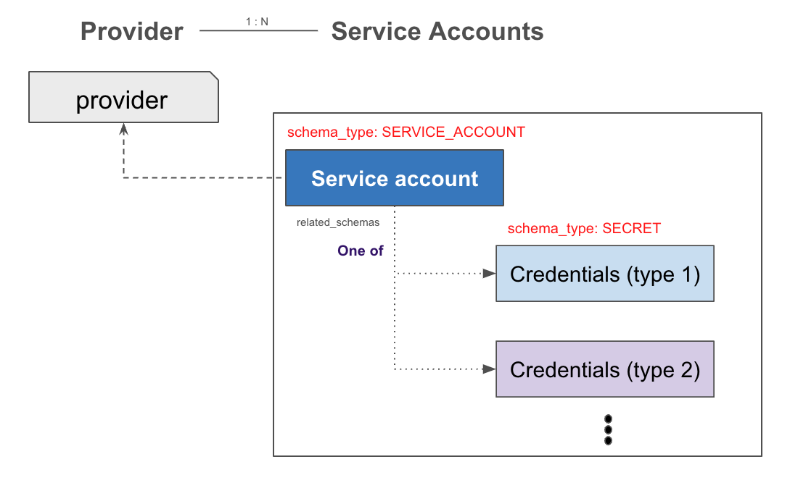
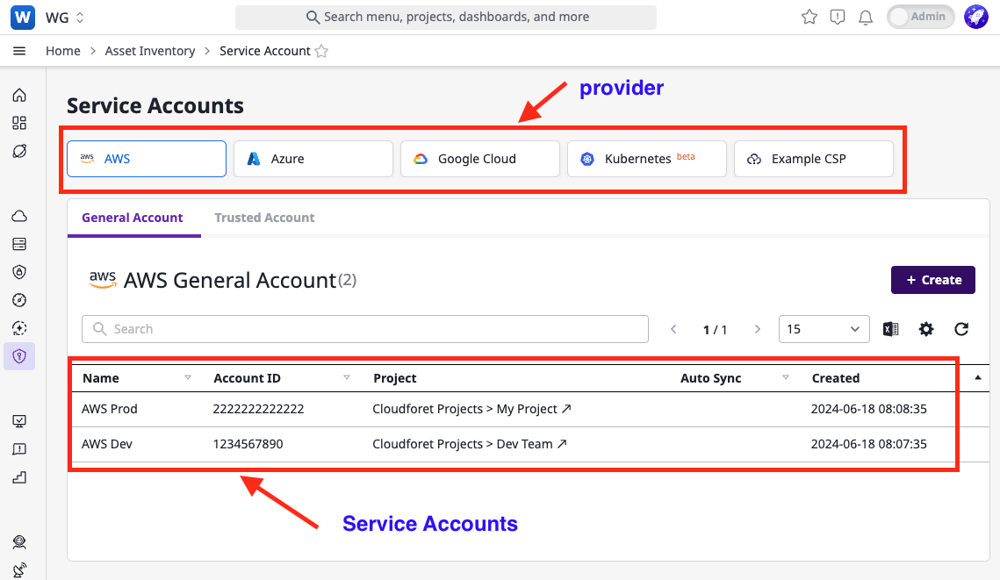

## User Experience: Console

## Provider

In the context of Cloudforet, a provider is a top-level entity that groups a range of resources. Providers can include cloud providers like Amazon Web Services (AWS), Google Cloud Platform (GCP), and Microsoft Azure, as well as any entity that groups together like software_licence.

## Service Account

A service account functions as an identifier for a group of resources within a provider. This means that the service account is used as primary key for distinguishing a specific set of resources.

## API Reference

| Resource        | API Description                                           |
|-----------------|-----------------------------------------------------------|
| Provider        | https://cloudforet.io/api-doc/identity/v2/Provider/       |
| Service Account | https://cloudforet.io/api-doc/identity/v2/ServiceAccount/ |
| Schema          | https://cloudforet.io/api-doc/identity/v2/Schema/         |