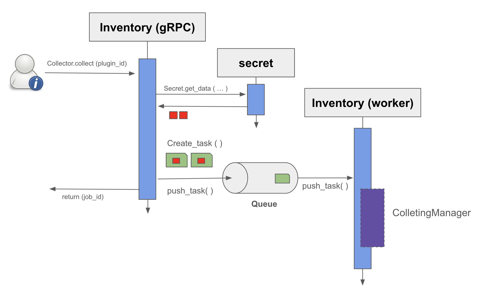
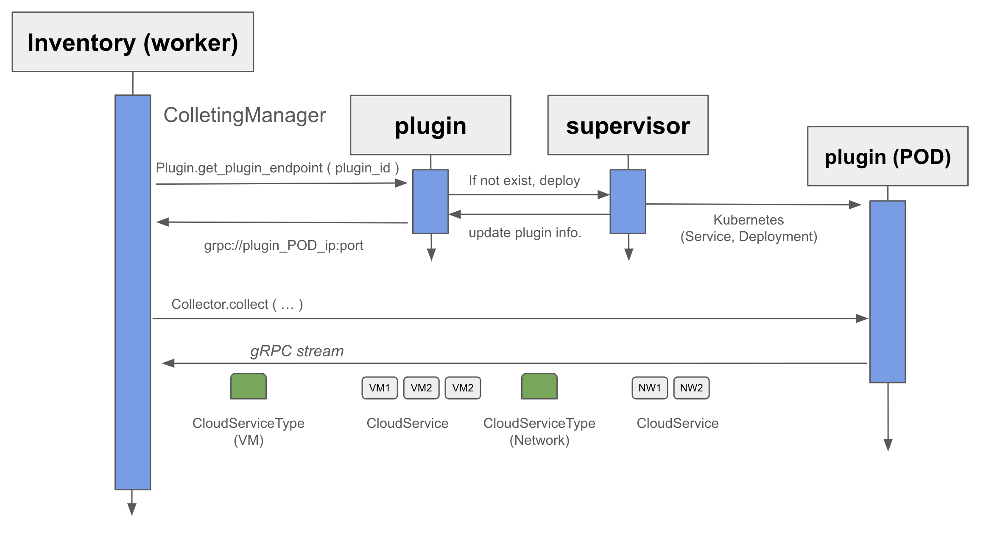

## How to collect

When user create a collect API call, the collecting task is created, then pushed the queue. Inventory Worker patches the task then execute the task, which is collecting the resources from the plugin.

## Collecting Manager

