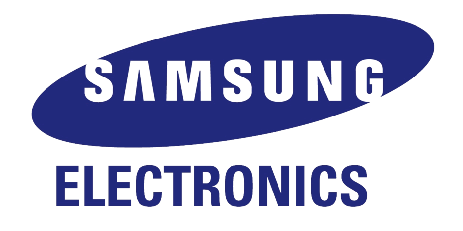

# What is the SpaceONE Foundation
The SpaceONE Foundation is the organization that oversees the development of the [SpaceONE open source project](https://github.com/spaceone-dev).
Members of the SpaceONE Foundation provide essential financial support for the collaborative development process, including tooling, infrastructure,
community conferences.

# Become a member

The SpaceONE  Foundation has two membership levels: Premier, and Associate.

***Premier members*** play a critical role in providing support that makes the community's work possible. Organizations are highlighted as the community members who are collaborating with the global SpaceONE community to advance open source.

The Premier members each contribute $30K USD per year to the Foundation to support the global community and must also have the equivalent of 2 full time empoloyees contribuing to SpaceONE Foundation projects. The Premier members are limited to Associate Members of the Linux Foundation.

All Premier Members are subject to board approval.

If you are interested in joining as a founding corporate member for the SpaceONE Foundation, please Contact us.

***Associate members*** play an important role in helping the Foundation achieve its mission of building open source communities that write software to run in production. Organizations can apply now to become founding Associate member of the new SpaceONE Foundation.

The Associate members each contribute $10K USD per year.

## SpaceONE Premier Members

&nbsp;&nbsp;&nbsp;

## SpaceONE Associate Members

# Participate as an Individual Member

Everyone is welcome - the SpaceONE community is inclusive, diverse community, and all members agree to the SpaceONE Community Code of Conduct.

***It's free to participate as an individual Foundation member.***

