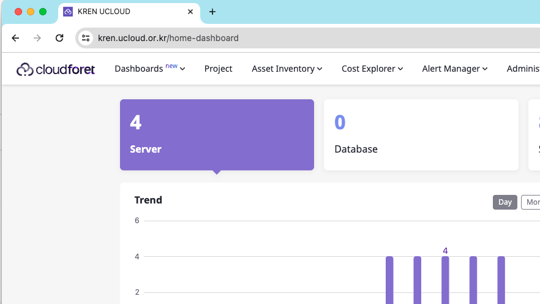
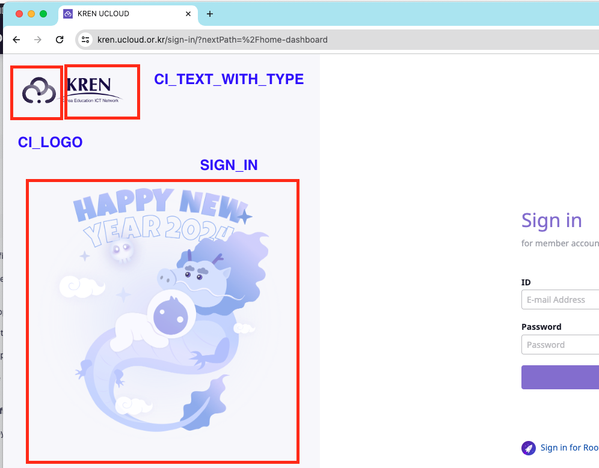
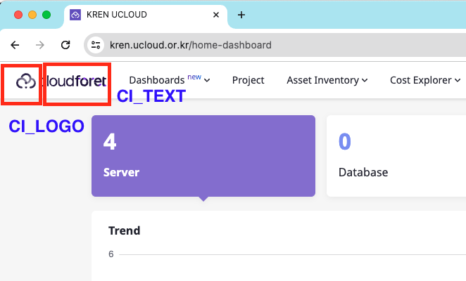

## Title and Favicon

Cloudforet has default title and CI with Wanny favicon.


But you can change them to your own title and favicon.



</br>

| Component   | File Path | Description |
| ---         | ---       | ---         |
| Title       | /var/www/title.txt | name of Title |
| Favicon     | /var/www/favicon.ico | favicon file |


Console supports the functionality of changing title and favicon.
The default values are in source code, but you can overwrite them when deploying pods.

**_NOTE:_**  Both Title and Favicon should be exist together, even though you want to configure one of them!

</br>
This is an example value of console.yaml file.

~~~
console:
  production_json:
    DOMAIN_NAME_REF: hostname
    CONSOLE_API:
      ENDPOINT: https://console-v1.api.example.com
    CONSOLE_API_V2:
      ENDPOINT: https://console-v2.api.example.com
    DOMAIN_IMAGE:
      CI_LOGO: https://raw.githubusercontent.com/cloudforet-io/artwork/main/logo/symbol/Cloudforet_symbol--dark-navy.svg
      CI_TEXT_WITH_TYPE: https://raw.githubusercontent.com/kren-ucloud/artwork/main/logo/KREN-logo.png
      SIGN_IN: https://raw.githubusercontent.com/cloudforet-io/artwork/main/illustrations/happy-new-year-2024.png
      CI_TEXT: https://raw.githubusercontent.com/cloudforet-io/artwork/main/logo/wordmark/Cloudforet_wordmark--primary.svg
  volumeMounts:
    application:
      - name: favicon
        mountPath: /var/www/title.txt
        subPath: title.txt
        readOnly: true
      - name: favicon-img
        mountPath: /var/www/favicon.ico
        subPath: favicon.ico
        readOnly: true

  volumes:
    - name: favicon
      configMap:
        name: favicon
    - name: favicon-img
      configMap:
        name: favicon-img
    - name: timezone
      hostPath:
        path: /usr/share/zoneinfo/Asia/Seoul
    - name: log-volume
      emptyDir: {}
      
~~~

The actual values are from Kubernetes ConfigMap object. So you might have to change the value at ConfigMap or create a new one and mount it in your pod.

### Title(title.yaml)

~~~
apiVersion: v1
kind: ConfigMap
metadata:
  name: favicon
  namespace: spaceone
data:
  title.txt: |
    KREN UCLOUD
~~~

Apply at your Kubernetes cluster.

```bash
kubectl apply -f title.yaml -n spaceone
```
### Favicon (favicon.yaml)

Cloudforet new Favicon file is
[favicon.yaml](./img/favicon.yaml)
~~~
apiVersion: v1
kind: ConfigMap
metadata:
  name: favicon-img
  namespace: spaceone
binaryData:
  favicon.ico: AAABAAEAAAAAAAEAIADxxxxxxx...
~~~

**_NOTE:_**  favicon.ico must be base64 encoded.

~~~bash
# prepare your favicon.ico file, and encode it to base64 (shell command)
cat favicon.ico | base64
~~~

Apply at your Kubernetes cluster.

```bash
kubectl apply -f favicon.yaml -n spaceone
```

## Corporate Identity

When you open Cloudforet page, you can see the default Cloudforet CI, logo and text.
You can change the default Cloudforet CI with your company CI.

### Login Page


### Every Page


Update helm value of console (console -> production_json -> DOMAIN_IMAGE)

keyword: ***DOMAIN_IMAGE***

| Configuration 	| Description | Format |
| ---           	|  ---         | ---   |
| CI_LOGO     		| Custom Logo Image | Image (56 * 56 px) |
| CI_TEXT_WITH_TYPE 	| CI Text Image | Image (164 * 40 px) |
| SIGN_IN 		| Sign-in page Image | Image (1024 * 1024 px) |
| CI_TEXT           	| CI Text Image On every page | Image (123 * 16 px)  |


**_NOTE:_**  Recommended file format is SVG. But if you would like to use a PNG file, use transparent background and double the size than recommended size.

**_NOTE:_**  Cloudforet does not support uploading files, so upload CI files at your web server or S3.!

~~~
console:
  production_json:
    DOMAIN_NAME_REF: hostname
    CONSOLE_API:
      ENDPOINT: https://console-v1.api.example.com
    CONSOLE_API_V2:
      ENDPOINT: https://console-v2.api.example.com
    DOMAIN_IMAGE:
      CI_LOGO: https://raw.githubusercontent.com/cloudforet-io/artwork/main/logo/symbol/Cloudforet_symbol--dark-navy.svg
      CI_TEXT_WITH_TYPE: https://raw.githubusercontent.com/kren-ucloud/artwork/main/logo/KREN-logo.png
      SIGN_IN: https://raw.githubusercontent.com/cloudforet-io/artwork/main/illustrations/happy-new-year-2024.png
      CI_TEXT: https://raw.githubusercontent.com/cloudforet-io/artwork/main/logo/wordmark/Cloudforet_wordmark--primary.svg
  volumeMounts:
    application:
      - name: favicon
        mountPath: /var/www/title.txt
        subPath: title.txt
        readOnly: true
      - name: favicon-img
        mountPath: /var/www/favicon.ico
        subPath: favicon.ico
        readOnly: true

  volumes:
    - name: favicon
      configMap:
        name: favicon
    - name: favicon-img
      configMap:
        name: favicon-img
    - name: timezone
      hostPath:
        path: /usr/share/zoneinfo/Asia/Seoul
    - name: log-volume
      emptyDir: {}
~~~


## Google Analytics

You can apply [Google Analytics](https://analytics.google.com/analytics) to Cloudforet Console by following the steps below.

### Create accounts and properties

1. Log in to your Google account after accessing the [Google Analytics](https://analytics.google.com/analytics) site.
2. Click the **Start Measurement** button.

    

3. Enter your **account name** and click the **Next** button.

    

4. Enter a **property name** and click the **Next** button.

    In the property name, enter the name of the url you want to track.

    

5. Click the **Create** button.

    

6. Click the **Agree** button after agreeing to the data processing terms.

    


### Set up data streams

1. Choose **Web** as the platform for the data stream you want to collect.

    

2. Enter your **Cloudforet Console website URL** and **stream name** and click the **Create Stream** button.

    

3. Check the created stream information and **copy the measurement ID**.

    


### Set up the Cloudforet Helm Chart

Paste the copied **measurement ID** as the value for the `GTAG_ID` key in the helm chart settings as shown below.

```
# frontend.yaml
console:
  ...
  production_json:
    ...
    GTAG_ID: {measurement ID}
    ...
```

