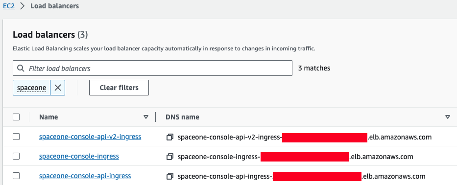

## Ingress and AWS Load Balancer

In Kubernetes, Ingress is an API object that provides a load-balanced external IP address to access Services in your cluster. It acts as a layer 7 (HTTP/HTTPS) reverse proxy and can route traffic to other services based on the requested host and URL path.

For more information, see [What is an Application Load Balancer?](https://docs.aws.amazon.com/elasticloadbalancing/latest/application/introduction.html) on AWS and [ingress](https://kubernetes.io/docs/concepts/services-networking/ingress/) in the Kubernetes documentation.

### Prerequisite
**Install AWS Load Balancer Controller**  
*AWS Load Balancer Controller* is a controller that helps manage ELB (Elastic Load Balancers) in a Kubernetes Cluster. Ingress resources are provisioned with Application Load Balancer, and service resources are provisioned with Network Load Balancer.   
Installation methods may vary depending on the environment, so please refer to the official guide document below.
- https://kubernetes-sigs.github.io/aws-load-balancer-controller/v2.5/deploy/installation/


## How to set up Cloudforet ingress
### 1) Ingress Type
Cloudforet provisions a total of 3 ingresses through 2 files.
- Console : Ingress to access the domain
- REST API : Ingress for API service
- - console-api
- - console-api-v2

### 2) Console ingress
Setting the ingress to accerss the console is as follows.
```yaml
cat <<EOF> cloudforet-console-ingress.yaml
---
apiVersion: networking.k8s.io/v1
kind: Ingress
metadata:
  name: console-ingress
  namespace: spaceone
  annotations:
    alb.ingress.kubernetes.io/listen-ports: '[{"HTTP": 80}]'
    alb.ingress.kubernetes.io/scheme: internet-facing
    alb.ingress.kubernetes.io/target-type: ip
    alb.ingress.kubernetes.io/load-balancer-attributes: idle_timeout.timeout_seconds=600
    alb.ingress.kubernetes.io/healthcheck-protocol: HTTP
    alb.ingress.kubernetes.io/success-codes: 200-399
    alb.ingress.kubernetes.io/load-balancer-name: spaceone-console-ingress # Caution!! Must be fewer than 32 characters.
spec:
  ingressClassName: alb
  defaultBackend:
    service:
      name: console
      port:
        number: 80
EOF
```
```bash
# Apply ingress
kubectl apply -f spaceone-console-ingress.yaml
```

If you apply the ingress, it will be provisioned to AWS Load Balancer with the name `spaceone-console-ingress`. You can connect through the provisioned DNS name using HTTP (80 Port).

### 3) REST API ingress
Setting the REST API ingress for the API service is as follows.
```yaml
cat <<EOF> spaceone-rest-ingress.yaml
---
apiVersion: networking.k8s.io/v1
kind: Ingress
metadata:
  name: console-api-ingress
  namespace: spaceone
  annotations:
    alb.ingress.kubernetes.io/listen-ports: '[{"HTTP": 80}]'
    alb.ingress.kubernetes.io/scheme: internet-facing
    alb.ingress.kubernetes.io/target-type: ip
    alb.ingress.kubernetes.io/load-balancer-attributes: idle_timeout.timeout_seconds=600
    alb.ingress.kubernetes.io/healthcheck-protocol: HTTP
    alb.ingress.kubernetes.io/success-codes: 200-399
    alb.ingress.kubernetes.io/load-balancer-name: spaceone-console-api-ingress # Caution!! Must be fewer than 32 characters.
spec:
  ingressClassName: alb
  defaultBackend:
    service:
      name: console-api
      port:
        number: 80
---
apiVersion: networking.k8s.io/v1
kind: Ingress
metadata:
  name: console-api-v2-ingress
  namespace: spaceone
  annotations:
    alb.ingress.kubernetes.io/listen-ports: '[{"HTTP": 80}]'
    alb.ingress.kubernetes.io/scheme: internet-facing
    alb.ingress.kubernetes.io/target-type: ip
    alb.ingress.kubernetes.io/load-balancer-attributes: idle_timeout.timeout_seconds=600
    alb.ingress.kubernetes.io/healthcheck-protocol: HTTP
    alb.ingress.kubernetes.io/success-codes: 200-399
    alb.ingress.kubernetes.io/load-balancer-name: spaceone-console-api-v2-ingress
spec:
  ingressClassName: alb
  defaultBackend:
    service:
      name: console-api-v2-rest
      port:
        number: 80
EOF
```

```bash
# Apply ingress
kubectl apply -f spaceone-rest-ingress.yaml
```

REST API ingress provisions two ALBs. The DNS Name of the REST API must be saved as `console.CONSOLE_API.ENDPOINT` and `console.CONSOLE_API_V2.ENDPOINT` in the `values.yaml` file.

### 4) Check DNS Name
The DNS name will be generated as `http://{ingress-name}-{random}.{region-code}.elb.amazoneaws.com`. You can check this through the `kubectl get ingress -n spaceone` command in Kubernetes.
 ```bash
kubectl get ingress -n spaceone

NAME                     CLASS   HOSTS   ADDRESS                                                                      PORTS   AGE
console-api-ingress      alb     *       spaceone-console-api-ingress-xxxxxxxxxx.{region-code}.elb.amazonaws.com     80      15h
console-api-v2-ingress   alb     *       spaceone-console-api-v2-ingress-xxxxxxxxxx.{region-code}.elb.amazonaws.com   80      15h
console-ingress          alb     *       spaceone-console-ingress-xxxxxxxxxx.{region-code}.elb.amazonaws.com         80      15h

 ```
Or, you can check it in AWS Console. You can check it in EC2 > Load balancer as shown in the image below.



### 5) Connect with DNS Name
When all ingress is ready, edit the `values.yaml` file, restart pods, and access the console.

```yaml
console:
  production_json:
    # If you don't have a service domain, you refer to the following 'No Domain & IP Access' example.
    CONSOLE_API:
      ENDPOINT: http://spaceone-console-api-ingress-xxxxxxxxxx.{region-code}.elb.amazonaws.com
    CONSOLE_API_V2:
      ENDPOINT: http:spaceone-console-api-v2-ingress-xxxxxxxxxx.{region-code}.elb.amazonaws.com
```

After applying the prepared `values.yaml` file, restart the pods.
```bash
helm upgrade cloudforet cloudforet/spaceone -n spaceone -f values.yaml
kubectl delete po -n spaceone -l app.kubernetes.io/instance=cloudforet
```

Now you can connect to Cloudforet with the DNS Name of `spaceone-console-ingress`.
- `http://spaceone-console-ingress-xxxxxxxxxx.{region-code}.elb.amazonaws.com`

# Advanced ingress settings
## How to register an SSL certificate
We will guide you through how to register a certificate in ingress for SSL communication.  
There are two methods for registering a certificate. One is when using ACM(AWS Certificate Manager), and the other is how to register an external certificate. 

### How to register an ACM certificate with ingress
If the certificate was issued through ACM, you can register the SSL certificate by simply registering acm arn in ingress.  

First of all, please refer to the AWS official guide document on how to issue a certificate.
- [https://docs.aws.amazon.com/ko_kr/acm/latest/userguide/gs.html](https://docs.aws.amazon.com/ko_kr/acm/latest/userguide/gs.html)

How to register the issued certificate is as follows. Please check the options added or changed for SSL communication in existing ingress.

> **Check out the changes in ingress.**  
Various settings for SSL are added and changed. Check the contents of `metadata.annotations`.  
Also, check the added contents such as `ssl-redirect` and `spec.rules.host` in `spec.rules`.

- spaceone-console-ingress.yaml
```diff 
apiVersion: networking.k8s.io/v1
kind: Ingress
metadata:
  name: console-ingress
  namespace: spaceone
  annotations:
+   alb.ingress.kubernetes.io/actions.ssl-redirect: '{"Type": "redirect", "RedirectConfig": { "Protocol": "HTTPS", "Port": "443", "StatusCode": "HTTP_301"}}'
+   alb.ingress.kubernetes.io/listen-ports: '[{"HTTP": 80}, {"HTTPS":443}]'
-   alb.ingress.kubernetes.io/listen-ports: '[{"HTTP": 80}]'
    alb.ingress.kubernetes.io/scheme: internet-facing
    alb.ingress.kubernetes.io/target-type: ip
    alb.ingress.kubernetes.io/load-balancer-attributes: idle_timeout.timeout_seconds=600
    alb.ingress.kubernetes.io/healthcheck-protocol: HTTP
+   alb.ingress.kubernetes.io/certificate-arn: "arn:aws:acm:..."  # Change the certificate-arn
    alb.ingress.kubernetes.io/success-codes: 200-399
    alb.ingress.kubernetes.io/load-balancer-name: spaceone-console-ingress # Caution!! Must be fewer than 32 characters.
spec:
  ingressClassName: alb
- defaultBackend:
-   service:
-     name: console
-     port:
-       number: 80
+ rules:
+   - http:
+       paths:
+         - path: /*
+           pathType: ImplementationSpecific
+           backend:
+             service:
+               name: ssl-redirect
+               port:
+                 name: use-annotation
+   - host: "console.example.com"  # Change the hostname
+     http:
+       paths:
+         - path: /*
+           pathType: ImplementationSpecific
+           backend:
+             service:
+               name: console 
+               port:
+                 number: 80
```

- spaceone-rest-ingress.yaml
```diff
apiVersion: networking.k8s.io/v1
kind: Ingress
metadata:
  name: console-api-ingress
  namespace: spaceone
  annotations:
+   alb.ingress.kubernetes.io/actions.ssl-redirect: '{"Type": "redirect", "RedirectConfig": { "Protocol": "HTTPS", "Port": "443", "StatusCode": "HTTP_301"}}'
+   alb.ingress.kubernetes.io/listen-ports: '[{"HTTP": 80}, {"HTTPS":443}]'
-   alb.ingress.kubernetes.io/listen-ports: '[{"HTTP": 80}]'
    alb.ingress.kubernetes.io/scheme: internet-facing
    alb.ingress.kubernetes.io/target-type: ip
    alb.ingress.kubernetes.io/load-balancer-attributes: idle_timeout.timeout_seconds=600
    alb.ingress.kubernetes.io/healthcheck-protocol: HTTP
+   alb.ingress.kubernetes.io/certificate-arn: "arn:aws:acm:..."  # Change the certificate-arn
    alb.ingress.kubernetes.io/success-codes: 200-399
    alb.ingress.kubernetes.io/load-balancer-name: spaceone-console-api-ingress # Caution!! Must be fewer than 32 characters.
spec:
  ingressClassName: alb
- defaultBackend:
-   service:
-     name: console-api
-     port:
-       number: 80
+ rules:
+   - http:
+       paths:
+         - path: /*
+           pathType: ImplementationSpecific
+           backend:
+             service:
+               name: ssl-redirect
+               port:
+                 name: use-annotation
+   - host: "console.api.example.com"  # Change the hostname
+     http:
+       paths:
+         - path: /*
+           pathType: ImplementationSpecific
+           backend:
+             service:
+               name: console-api
+               port:
+                 number: 80
---
apiVersion: networking.k8s.io/v1
kind: Ingress
metadata:
  name: console-api-v2-ingress
  namespace: spaceone
  annotations:
+   alb.ingress.kubernetes.io/actions.ssl-redirect: '{"Type": "redirect", "RedirectConfig": { "Protocol": "HTTPS", "Port": "443", "StatusCode": "HTTP_301"}}'
+   alb.ingress.kubernetes.io/listen-ports: '[{"HTTP": 80}, {"HTTPS":443}]'
-   alb.ingress.kubernetes.io/listen-ports: '[{"HTTP": 80}]'
    alb.ingress.kubernetes.io/scheme: internet-facing
    alb.ingress.kubernetes.io/target-type: ip
    alb.ingress.kubernetes.io/load-balancer-attributes: idle_timeout.timeout_seconds=600
    alb.ingress.kubernetes.io/healthcheck-protocol: HTTP
+   alb.ingress.kubernetes.io/certificate-arn: "arn:aws:acm:..."  # Change the certificate-arn
    alb.ingress.kubernetes.io/success-codes: 200-399
    alb.ingress.kubernetes.io/load-balancer-name: spaceone-console-api-v2-ingress
spec:
  ingressClassName: alb
- defaultBackend:
-   service:
-     name: console-api-v2-rest
-     port:
-       number: 80
+ rules:
+   - http:
+       paths:
+         - path: /*
+           pathType: ImplementationSpecific
+           backend:
+             service:
+               name: ssl-redirect
+               port:
+                 name: use-annotation
+   - host: "console-v2.api.example.com"  # Change the hostname
+     http:
+       paths:
+         - path: /*
+           pathType: ImplementationSpecific
+           backend:
+             service:
+               name: console-api-v2-rest
+               port:
+                 number: 80
```

SSL application is completed when the changes are reflected through the kubectl command.
```bash
kubectl apply -f spaceone-console-ingress.yaml
kubectl apply -f spaceone-rest-ingress.yaml
```

### How to register an SSL/TLS certificate
Certificate registration is possible even if you have an external certificate that was previously issued. You can register by adding a Kubernetes `secret` using the issued certificate and declaring the added `secret` name in ingress.

Create SSL/TLS certificates as Kubernetes secrets. There are two ways:

1. **Using yaml file**  
You can add a secret to a yaml file using the command below.
    ```yaml
    kubectl apply -f <<EOF> tls-secret.yaml
    apiVersion: v1
    data:
      tls.crt: {your crt}   # crt
      tls.key: {your key}   # key
    kind: Secret
    metadata:
      name: tls-secret
      namespace: spaceone
    type: kubernetes.io/tls
    EOF
    ```

2. **How to use the command if a file exists**  
If you have a crt and key file, you can create a secret using the following command.

    ```yaml
    kubectl create secret tls tlssecret --key tls.key --cert tls.crt
    ```

### Add tls secret to Ingress
Modify ingress using registered secret information.

> **ingress-nginx settings**  
Using secret and tls may require setup methods using ingress-nginx. For more information, please refer to the following links:  
> - [https://kubernetes.github.io/ingress-nginx/user-guide/tls/](https://kubernetes.github.io/ingress-nginx/user-guide/tls/)
> - [https://kubernetes.io/docs/concepts/services-networking/ingress/#tls](https://kubernetes.io/docs/concepts/services-networking/ingress/#tls)

```yaml
apiVersion: networking.k8s.io/v1
kind: Ingress
metadata:
  name: console-ingress
  namespace: spaceone
  annotations:
    alb.ingress.kubernetes.io/actions.ssl-redirect: '{"Type": "redirect", "RedirectConfig": { "Protocol": "HTTPS", "Port": "443", "StatusCode": "HTTP_301"}}'
    alb.ingress.kubernetes.io/listen-ports: '[{"HTTP": 80}, {"HTTPS":443}]'
    alb.ingress.kubernetes.io/scheme: internet-facing
    alb.ingress.kubernetes.io/target-type: ip
    alb.ingress.kubernetes.io/load-balancer-attributes: idle_timeout.timeout_seconds=600
    alb.ingress.kubernetes.io/healthcheck-protocol: HTTP
    alb.ingress.kubernetes.io/success-codes: 200-399
    alb.ingress.kubernetes.io/load-balancer-name: spaceone-console-ingress # Caution!! Must be fewer than 32 characters.
spec:
  tls:
  - hosts:
      - console.example.com        # Change the hostname
    secretName: tlssecret          # Insert secret name
  rules:
    - http:
        paths:
          - path: /*
            pathType: ImplementationSpecific
            backend:
              service:
                name: ssl-redirect
                port:
                  name: use-annotation
    - host: "console.example.com"  # Change the hostname
      http:
        paths:
          - path: /*
            pathType: ImplementationSpecific
            backend:
              service:
                name: console 
                port:
                  number: 80

```
