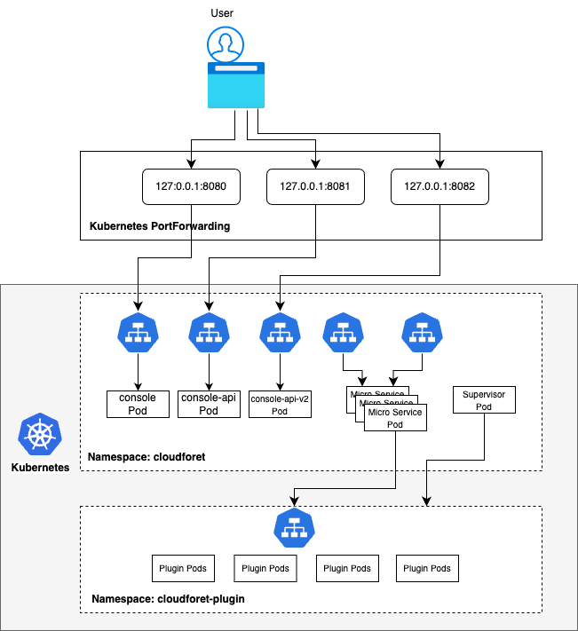

This is Getting Started Installation guide with minikube.

> Note :- This Guide is not for production, but for developer only.

**Verified Environments**

| Distro     | Status             | Link(ex. Blog)   |
| ---        | ---                | ---    |
| Ubuntu 20.04    |  Not Tested   |    |
| Ubuntu 22.04    |  Verified   |    |
| Amazon Linux 2  |  Not Tested      |    |
| Amazon Linux 2023  | Not Tested    |    |
| macOS (Apple Silicon, M1) | Verified |   |
| macOS (Apple Silicon, M2) | Verified   |   |
| Windows         |  Verified   |  https://medium.com/@ayushsharma2267410/installation-of-cloudforet-in-windows-8c4a10c9a65f     |



## Overview

### Cloudforet-Minikube Architecture


---


## Prerequisites
- AWS EC2 VM (Intel/AMD/ARM CPU)
 > Recommended instance type: t3.large (2 cores, 8 GB Memory, **30GB EBS**)
- [Docker/Docker Desktop](https://docs.docker.com/engine/install/) 
  - If you don't have Docker installed, minikube will return an error as minikube uses docker as the driver.
  - Highly recommend installing **Docker Desktop** based on your OS.
- [Minikube](https://minikube.sigs.k8s.io/docs/start/)
  - Requires minimum **Kubernetes version of 1.21+**.  
- [Kubectl](https://kubernetes.io/docs/tasks/tools/)
- [Helm](https://helm.sh/docs/intro/install/) 
  - Requires minimum **Helm version of 3.11.0+**.
  - If you want to learn more about Helm, refer to [this](https://helm.sh/).


Before diving into the Cloudforet Installation process, start minikube by running the command below. 


~~~
minikube start --driver=docker --memory=5000mb
~~~
> If you encounter ```Unable to resolve the current Docker CLI context "default"``` error, check if the docker daemon is running.


## Installation
You can install the Cloudforet by the following the steps below.

> For Cloudforet v1.12.x, we DONOT provide helm charts online. You can download the helm chart from the Cloudforet Github

### 1) Download Helm Chart Repository
This command wll download Helm repository.

```bash
# Set working directory
mkdir cloudforet-deployment
cd cloudforet-deployment
wget https://github.com/cloudforet-io/charts/releases/download/spaceone-1.12.12/spaceone-1.12.12.tgz
tar zxvf spaceone-1.12.12.tgz
```

### 2) Create Namespaces

```bash
kubectl create ns cloudforet
```
```bash
kubectl create ns cloudforet-plugin
```


### 3) Create Role and RoleBinding
First, download the [rbac.yaml](https://github.com/cloudforet-io/charts/blob/master/examples/rbac.yaml) file.


The rbac.yaml file basically serves as a means to regulate access to computer or network resources based on the roles of individual users. For more information about RBAC Authorization in Kubernetes, refer to [this](https://kubernetes.io/docs/reference/access-authn-authz/rbac/).

If you are used to downloading files via command-line, run this command to download the file. 
```bash
wget https://raw.githubusercontent.com/cloudforet-io/charts/master/examples/rbac.yaml -O rbac.yaml
```

Next, execute the following command.
```bash
kubectl apply -f rbac.yaml -n cloudforet-plugin
```

### 4) Install Cloudforet Chart

Download default YAML file for helm chart.

```bash
wget https://raw.githubusercontent.com/cloudforet-io/charts/master/examples/values/release-1-12.yaml -O release-1-12.yaml
helm install cloudforet spaceone -n cloudforet -f release-1-12.yaml
```

After executing the above command, check the status of the pod.

> Scheduler pods are in `CrashLoopBackOff` or `Error` state. This is because the setup is not complete.

```bash
kubectl get pod -n cloudforet

NAME                                      READY   STATUS             RESTARTS      AGE
board-5746fd9657-vtd45                    1/1     Running            0             57s
config-5d4c4b7f58-z8k9q                   1/1     Running            0             58s
console-6b64cf66cb-q8v54                  1/1     Running            0             59s
console-api-7c95848cb8-sgt56              2/2     Running            0             58s
console-api-v2-rest-7d64bc85dd-987zn      2/2     Running            0             56s
cost-analysis-7b9d64b944-xw9qg            1/1     Running            0             59s
cost-analysis-scheduler-ff8cc758d-lfx4n   0/1     Error              3 (37s ago)   55s
cost-analysis-worker-559b4799b9-fxmxj     1/1     Running            0             58s
dashboard-b4cc996-mgwj9                   1/1     Running            0             56s
docs-5fb4cc56c7-68qbk                     1/1     Running            0             59s
identity-6fc984459d-zk8r9                 1/1     Running            0             56s
inventory-67498999d6-722bw                1/1     Running            0             57s
inventory-scheduler-5dc6856d44-4spvm      0/1     CrashLoopBackOff   3 (18s ago)   59s
inventory-worker-68d9fcf5fb-x6knb         1/1     Running            0             55s
marketplace-assets-8675d44557-ssm92       1/1     Running            0             59s
mongodb-7c9794854-cdmwj                   1/1     Running            0             59s
monitoring-fdd44bdbf-pcgln                1/1     Running            0             59s
notification-5b477f6c49-gzfl8             1/1     Running            0             59s
notification-scheduler-675696467-gn24j    1/1     Running            0             59s
notification-worker-d88bb6df6-pjtmn       1/1     Running            0             57s
plugin-556f7bc49b-qmwln                   1/1     Running            0             57s
plugin-scheduler-86c4c56d84-cmrmn         0/1     CrashLoopBackOff   3 (13s ago)   59s
plugin-worker-57986dfdd6-v9vqg            1/1     Running            0             58s
redis-75df77f7d4-lwvvw                    1/1     Running            0             59s
repository-5f5b7b5cdc-lnjkl               1/1     Running            0             57s
secret-77ffdf8c9d-48k46                   1/1     Running            0             55s
spacectl-5664788d5d-dtwpr                 1/1     Running            0             59s
statistics-67b77b6654-p9wcb               1/1     Running            0             56s
statistics-scheduler-586875947c-8zfqg     0/1     Error              3 (30s ago)   56s
statistics-worker-68d646fc7-knbdr         1/1     Running            0             58s
supervisor-scheduler-6744657cb6-tpf78     2/2     Running            0             59s
```
> To execute the commands below, every POD except xxxx-scheduler-yyyy must have a Running status.

### 5) Initialize the Configuration  
First, download the [initializer.yaml](https://raw.githubusercontent.com/cloudforet-io/charts/master/examples/initializer.yaml) file.

For more information about the initializer, please refer to the [spaceone-initializer](https://github.com/cloudforet-io/spaceone-initializer).

If you are used to downloading files via command-line, run this command to download the file.
```bash
wget https://raw.githubusercontent.com/cloudforet-io/charts/master/examples/initializer.yaml -O initializer.yaml
```
And execute the following command.
```bash
wget https://github.com/cloudforet-io/charts/releases/download/spaceone-initializer-1.3.3/spaceone-initializer-1.3.3.tgz
tar zxvf spaceone-initializer-1.3.3.tgz
helm install initializer spaceone-initializer -n cloudforet -f initializer.yaml
```

### 6) Set the Helm Values and Upgrade the Chart
Complete the initialization, you can get the system token from the initializer pod logs.

To figure out the pod name for the initializer, run this command first to show all pod names for namespace spaceone.
```bash
kubectl get pods -n cloudforet 
```
Then, among the pods shown copy the name of the pod that starts with **initialize-spaceone**.

```bash
NAME                                       READY   STATUS      RESTARTS   AGE
board-5997d5688-kq4tx                      1/1     Running     0          24m
config-5947d845b5-4ncvn                    1/1     Running     0          24m
console-7fcfddbd8b-lbk94                   1/1     Running     0          24m
console-api-599b86b699-2kl7l               2/2     Running     0          24m
console-api-v2-rest-cb886d687-d7n8t        2/2     Running     0          24m
cost-analysis-8658c96f8f-88bmh             1/1     Running     0          24m
cost-analysis-scheduler-67c9dc6599-k8lgx   1/1     Running     0          24m
cost-analysis-worker-6df98df444-5sjpm      1/1     Running     0          24m
dashboard-84d8969d79-vqhr9                 1/1     Running     0          24m
docs-6b9479b5c4-jc2f8                      1/1     Running     0          24m
identity-6d7bbb678f-b5ptf                  1/1     Running     0          24m
initialize-spaceone-fsqen-74x7v            0/1     Completed   0          98m
inventory-64d6558bf9-v5ltj                 1/1     Running     0          24m
inventory-scheduler-69869cc5dc-k6fpg       1/1     Running     0          24m
inventory-worker-5649876687-zjxnn          1/1     Running     0          24m
marketplace-assets-5fcc55fb56-wj54m        1/1     Running     0          24m
mongodb-b7f445749-2sr68                    1/1     Running     0          101m
monitoring-799cdb8846-25w78                1/1     Running     0          24m
notification-c9988d548-gxw2c               1/1     Running     0          24m
notification-scheduler-7d4785fd88-j8zbn    1/1     Running     0          24m
notification-worker-586bc9987c-kdfn6       1/1     Running     0          24m
plugin-79976f5747-9snmh                    1/1     Running     0          24m
plugin-scheduler-584df5d649-cflrb          1/1     Running     0          24m
plugin-worker-58d5cdbff9-qk5cp             1/1     Running     0          24m
redis-b684c5bbc-528q9                      1/1     Running     0          24m
repository-64fc657d4f-cbr7v                1/1     Running     0          24m
secret-74578c99d5-rk55t                    1/1     Running     0          24m
spacectl-8cd55f46c-xw59j                   1/1     Running     0          24m
statistics-767d84bb8f-rrvrv                1/1     Running     0          24m
statistics-scheduler-65cc75fbfd-rsvz7      1/1     Running     0          24m
statistics-worker-7b6b7b9898-lmj7x         1/1     Running     0          24m
supervisor-scheduler-555d644969-95jxj      2/2     Running     0          24m
```
> To execute the below kubectl logs command, the status of POD(Ex: here initialize-spaceone-fsqen-74x7v) should be Completed . Proceeding with this while the POD is INITIALIZING will give errors

Get the token by getting the log information of the pod with the name you found above.
```bash
kubectl logs initialize-spaceone-fsqen-74x7v -n cloudforet

...
TASK [Print Admin API Key] *********************************************************************************************
"TOKEN_SHOWN_HERE"

FINISHED [ ok=23, skipped=0 ] ******************************************************************************************

FINISH SPACEONE INITIALIZE
```

Update your helm values file (ex. release-1-12.yaml) and edit the values. There is only one item that need to be updated.

> For EC2 users: put in your EC2 server's public IP instead of 127.0.0.1 for both CONSOLE_API and CONSOLE_API_V2 ENDPOINT.

* TOKEN

```yaml
console:
  production_json:
    CONSOLE_API:
      ENDPOINT: http://localhost:8081  # http://ec2_public_ip:8081 for EC2 users
    CONSOLE_API_V2:
      ENDPOINT: http://localhost:8082  # http://ec2_public_ip:8082 for EC2 users

global:
  shared_conf:
    TOKEN: 'TOKEN_VALUE_FROM_ABOVE'   # Change the system token
```

After editing the helm values file(ex. release-1-12.yaml), upgrade the helm chart.


```bash
helm upgrade cloudforet spaceone -n cloudforet -f release-1-12.yaml
```

After upgrading, delete the pods in cloudforet namespace that have the label app.kubernetes.io/instance and value cloudforet. 
```bash
kubectl delete po -n cloudforet -l app.kubernetes.io/instance=cloudforet
```

### 7) Check the status of the pods
```bash
kubectl get pod -n cloudforet
```

If all pods are in `Running` state, the setup is complete.

## Port-forwarding
Installing Cloudforet on minikube doesn't provide any Ingress objects such as Amazon ALB or NGINX ingress controller.
We can use **kubectl port-forward** instead.

Run the following commands for port forwarding.
~~~bash
# CLI commands
kubectl port-forward -n cloudforet svc/console 8080:80 --address='0.0.0.0' &
~~~
~~~bash
kubectl port-forward -n cloudforet svc/console-api 8081:80 --address='0.0.0.0' &
~~~
~~~bash
kubectl port-forward -n cloudforet svc/console-api-v2-rest 8082:80 --address='0.0.0.0' &
~~~

## Start Cloudforet

### Log-In (Sign in for Root Account)
> For EC2 users: open browser with http://your_ec2_server_ip:8080

Open browser (http://127.0.0.1:8080)

| ID | PASSWORD |
|---|---|
| admin | Admin123!@# |


### Initial Setup for Cloudforet
> For your reference, Cloudforet is an open source project for SpaceOne. For additional information, refer to our official website [here](https://spaceone.megazone.io/open-source).




## Reference

* [Full Installation Guide](https://github.com/cloudforet-io/charts)
* [Discuss channel](https://github.com/orgs/cloudforet-io/discussions/134)

