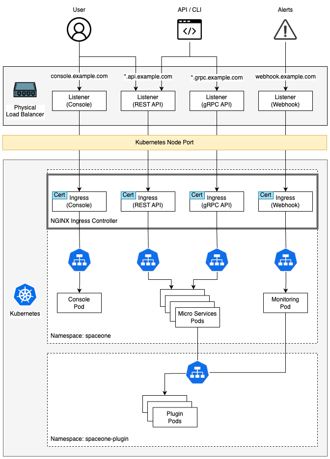

## Prerequisites

-   Kubernetes 1.21+ : [https://kubernetes.io/docs/setup/](https://kubernetes.io/docs/setup/)
    
-   Kubectl command-line tool : [https://kubernetes.io/docs/tasks/tools/](https://kubernetes.io/docs/tasks/tools/)
    
-   Helm 3.2.0+ : [https://helm.sh/docs/intro/install/](https://helm.sh/docs/intro/install/ )
    
-   Nginx Ingress Controller : [https://kubernetes.github.io/ingress-nginx/deploy/](https://kubernetes.github.io/ingress-nginx/deploy/)
    

## Cloudforet 설치

Helm chart를 이용하여 Cloudforet을 설치하는 방법을 안내합니다. 관련 내용은 다음에서도 확인 가능합니다. [https://github.com/cloudforet-io/charts](https://github.com/cloudforet-io/charts)

### 1. Add Helm Repository

```shell
helm repo add cloudforet https://cloudforet-io.github.io/charts 
helm repo update 
helm search repo
```

### 2. Create Namespaces
```shell
kubectl create ns spaceone 
kubectl create ns spaceone-plugin
```

> **namespace 생성 시 주의사항**  
하나의 namespace에서만 사용해야할 경우 `spaceone-plugin` namespace는 생성하지 않아도 됩니다.  
Cloudforet의 namespace를 변경하는 경우 다음의 링크를 참고하시기 바랍니다. [Change K8S Namespace](../configufation/change_k8s_namespace.md)

### 3. Create Role and RoleBinding

namespace를 합치지 않은 일반적이 상황에서는 supervisor가 `spaceone` namespace에서 `spaceone-plugin` namespace로 plugin을 배포하기 때문에, 아래와 같이 role, rolebinding이 필요합니다. 다음의 링크에서 내용을 확인하세요. [https://github.com/cloudforet-io/charts/blob/master/examples/rbac.yaml](https://github.com/cloudforet-io/charts/blob/master/examples/rbac.yaml)

자세한 권한의 내용은 아래와 같습니다. 필요한 경우 해당 파일을 편집해서 권한을 지정하면 됩니다.

-   파일 생성
    
    ``` shell
    cat <<EOF> rbac.yaml
    ---
    apiVersion: rbac.authorization.k8s.io/v1
    kind: Role
    metadata:
      name: supervisor-plugin-control-role
      namespace: spaceone-plugin 
    rules:
    - apiGroups:
      - "*"
      resources:
      - replicaSets
      - pods
      - deployments
      - services
      - endpoints
      verbs:
      - get
      - list
      - watch
      - create
      - delete
    ---
    apiVersion: rbac.authorization.k8s.io/v1
    kind: RoleBinding
    metadata:
      name: supervisor-role-binding
      namespace: spaceone-plugin 
    roleRef:
      apiGroup: rbac.authorization.k8s.io
      kind: Role
      name: supervisor-plugin-control-role
    subjects:
    - kind: ServiceAccount
      name: default
      namespace: spaceone
    EOF
    ```
    

권한을 적용하려면 아래의 명령어로 반영하면 됩니다. namespace를 변경했을 경우 변경한 namespace를 입력합니다. (namespace에 주의합니다.)

```shell
kubectl apply -f rbac.yaml -n spaceone-plugin
```

### 4. Install

다음의 helm 명령어를 통해서 설치를 진행합니다.

```shell
helm install cloudforet cloudforet/spaceone -n spaceone
```

명령어를 입력하고 나면 `spaceone` namespace에서 아래와 같이 pod들이 올라오는 것을 확인 할 수 있습니다.
```shell
kubectl get pod -n spaceone

NAME                                      READY   STATUS             RESTARTS      AGE
board-5746fd9657-vtd45                    1/1     Running            0             57s
config-5d4c4b7f58-z8k9q                   1/1     Running            0             58s
console-6b64cf66cb-q8v54                  1/1     Running            0             59s
console-api-7c95848cb8-sgt56              2/2     Running            0             58s
console-api-v2-rest-7d64bc85dd-987zn      2/2     Running            0             56s
cost-analysis-7b9d64b944-xw9qg            1/1     Running            0             59s
cost-analysis-scheduler-ff8cc758d-lfx4n   0/1     Error              3 (37s ago)   55s
cost-analysis-worker-559b4799b9-fxmxj     1/1     Running            0             58s
cost-analysis-worker-559b4799b9-nf5vs     1/1     Running            0             58s
cost-analysis-worker-559b4799b9-swzw8     1/1     Running            0             58s
cost-analysis-worker-559b4799b9-x8f4j     1/1     Running            0             58s
dashboard-b4cc996-mgwj9                   1/1     Running            0             56s
docs-5fb4cc56c7-68qbk                     1/1     Running            0             59s
identity-6fc984459d-zk8r9                 1/1     Running            0             56s
inventory-67498999d6-722bw                1/1     Running            0             57s
inventory-scheduler-5dc6856d44-4spvm      0/1     CrashLoopBackOff   3 (18s ago)   59s
inventory-worker-68d9fcf5fb-x6knb         1/1     Running            0             55s
marketplace-assets-8675d44557-ssm92       1/1     Running            0             59s
mongodb-7c9794854-cdmwj                   1/1     Running            0             59s
monitoring-fdd44bdbf-pcgln                1/1     Running            0             59s
notification-5b477f6c49-gzfl8             1/1     Running            0             59s
notification-scheduler-675696467-gn24j    1/1     Running            0             59s
notification-worker-d88bb6df6-pjtmn       1/1     Running            0             57s
plugin-556f7bc49b-qmwln                   1/1     Running            0             57s
plugin-scheduler-86c4c56d84-cmrmn         0/1     CrashLoopBackOff   3 (13s ago)   59s
plugin-worker-57986dfdd6-v9vqg            1/1     Running            0             58s
redis-75df77f7d4-lwvvw                    1/1     Running            0             59s
repository-5f5b7b5cdc-lnjkl               1/1     Running            0             57s
secret-77ffdf8c9d-48k46                   1/1     Running            0             55s
spacectl-5664788d5d-dtwpr                 1/1     Running            0             59s
statistics-67b77b6654-p9wcb               1/1     Running            0             56s
statistics-scheduler-586875947c-8zfqg     0/1     Error              3 (30s ago)   56s
statistics-worker-68d646fc7-knbdr         1/1     Running            0             58s
supervisor-scheduler-6744657cb6-tpf78     2/2     Running            0             59s
```

몇몇의 scheduler pod에 문제가 있는 상태로 나머지 pod들이 올라왔다면 현재로서는 올바른 상태입니다. scheduler의 문제는 initializer를 통해 token을 발급받은 후 `values.yaml` 파일을 이용한 upgrade 작업이 필요합니다.

### 5. Initialize the configuration

Cloudforet의 domain 생성을 위한 작업입니다. initializer를 통해 root domain을 생성하고 root token를 발급합니다.

spaceone-initializer는 다음 cloudforet-io github 사이트에서 확인 가능합니다. [https://github.com/cloudforet-io/spaceone-initializer](https://github.com/cloudforet-io/spaceone-initializer)

여기서 사용할 initializer.yaml 파일은 다음 링크에서 확인 가능합니다. [https://github.com/cloudforet-io/charts/blob/master/examples/initializer.yaml](https://github.com/cloudforet-io/charts/blob/master/examples/initializer.yaml)

initializer.yaml 파일에서 domain name, domain_owner.id/password 등을 변경 할 수 있습니다.

-   파일 생성
    
    ```shell
    cat <<EOF> filename.yaml
    main:
    import:
        - /root/spacectl/apply/root_domain.yaml
        - /root/spacectl/apply/register_marketplace.yaml
        - /root/spacectl/apply/user_domain.yaml
        - /root/spacectl/apply/create_role.yaml
        - /root/spacectl/apply/add_statistics_schedule.yaml
        - /root/spacectl/apply/print_api_key.yaml
    var:
        domain:
        root: root                      # 생성하는 root domain 이름 : root.example.com
        user: spaceone                  # 사용자를 위한 user domain 이름 : spaceone.example.com
        default_language: ko
        default_timezone: Asia/Seoul
        domain_owner:
        id: admin               # login user name
        password: Admin123!@#   # Change your password
        user:
        id: system_api_key
        marketplace_endpoint: grpc://repository.portal.spaceone.dev:50051
    EOF
    ```

해당 파일의 편집이 끝나면 아래 명령어를 통해서 initializer를 실행 합니다.
```shell
helm install initializer cloudforet/spaceone-initializer -n spaceone -f initializer.yaml
```

실행 후에는 지정한 `spaceone` namespace에 initializer pod가 생성되며 domain 생성작업을 수행합니다. pod가 `Completed` 상태가 되면 완료된 것이며 log를 확인 할 수 있습니다.

### 6. Set the Helm Values and Upgrade the chart

기본 설치된 helm chart에 customizing을 하기 위해서는 `values.yaml` 파일이 필요합니다.

`values.yaml` 파일에 관한 일반적인 예시는 다음의 링크에서 확인 가능합니다. [https://github.com/cloudforet-io/charts/blob/master/examples/values/all.yaml](https://github.com/cloudforet-io/charts/blob/master/examples/values/all.yaml)

scheduler의 문제를 해결하기 위해서 아래와 같이 Completed 상태의 pod log를 확인해서 admin token을 얻습니다.

```shell
kubectl logs initializer-5f5b7b5cdc-abcd1 -n spaceone

(omit)
TASK [Print Admin API Key] *********************************************************************************************
"{TOKEN}"

FINISHED [ ok=23, skipped=0 ] ******************************************************************************************

FINISH SPACEONE INITIALIZE
```

initializer pod log에서 얻은 token 값을 이용해서 `values.yaml` 파일을 생성합니다. 파일 내부에는 app 설정, namespace 변경, kubernetes 옵션 변경 등을 선언할 수 있습니다.

다음은 `values.yaml` 내부에 console 도메인 설정과 발급 받은 token을 전역 config로 사용 가능하도록 하는 설정입니다.

```yaml
console:
  production_json:
    # If you don't have a service domain, you refer to the following 'No Domain & IP Access' example.
    CONSOLE_API:
      ENDPOINT: https://console.api.example.com       # Change the endpoint
    CONSOLE_API_V2:
      ENDPOINT: https://console-v2.api.example.com    # Change the endpoint

global:
  shared_conf:
    TOKEN: '{TOKEN}'                                  # Change the system token
```

위와같이 `values.yaml` 파일 설정이 끝났다면 아래의 명령어로 helm upgrade 작업을 수행합니다. upgrade가 끝나고 난 뒤에는 모든 pod가 재시작 되도록 cloudforet 관련 app instance들을 모두 삭제합니다.

```shell
helm upgrade cloudforet cloudforet/spaceone -n spaceone -f values.yaml
kubectl delete po -n spaceone -l app.kubernetes.io/instance=cloudforet
```

### 7. Check the status of the pods

다음의 명령어로 pod의 상태를 확인합니다. 모든 pod들이 `Running` 상태라면 설치 완료 입니다.

```shell
kubectl get pod -n spaceone
```

### 8. Configuration Ingress

Kubernetes Ingress는 Cluster내 Service와 외부의 연결을 관리해주는 리소스입니다. Cloudforet에서는 아래의 순서에 따라 생성된 인증서를 secret으로 등록하고 ingress를 추가하여 서비스 됩니다.

> **Nginx Ingress Controller 설치**  
On-premise 환경에서 ingress를 사용하기 위해서는 ingress controller가 필요합니다. 다음은 Kubernetes에서 지원하는 Nginx Ingress Controller의 설치 가이드 링크입니다.  
> - Nginx Ingress Controller : [https://kubernetes.github.io/ingress-nginx/deploy/](https://kubernetes.github.io/ingress-nginx/deploy/)

#### Generate self-managed SSL

아래의 openssl 명령어를 이용해서 사설 ssl 인증서를 생성합니다. (준비된 인증서가 있다면 사설 인증서 생성은 skip 해도 됩니다.)

-   console
    
    -   *.{domain}
        
```shell
openssl req -x509 -nodes -days 365 -newkey rsa:2048 -keyout console_ssl.pem -out console_ssl.csr -subj "/CN=*.{domain}/O=spaceone" -addext "subjectAltName = DNS:*.{domain}"
```

-   api
    
    -   *.api.{domain}

```shell
openssl req -x509 -nodes -days 365 -newkey rsa:2048 -keyout api_ssl.pem -out api_ssl.csr -subj "/CN=*.api.{domain}/O=spaceone" -addext "subjectAltName = DNS:*.api.{domain}"
```        

#### Create secret for ssl

인증서가 준비 되었다면 해당 인증서 파일을 이용해서 secret을 생성합니다.

```shell
kubectl create secret tls console-ssl --key console_ssl.pem --cert console_ssl.csr
```

```shell
kubectl create secret tls api-ssl --key api_ssl.pem --cert api_ssl.csr
```

#### Create Secret from certificate_secret.yaml file

인증서가 준비 되었다면 `certificate_secert.yaml` 파일을 편집합니다. 해당 파일은 다음의 링크에서 다운로드 할 수 있습니다. 또한 다운로드받은 내용을 아래와 같이 편집하여 사용 합니다. [https://github.com/cloudforet-io/charts/blob/master/examples/ingress/on_premise/certificate_secret.yaml](https://github.com/cloudforet-io/charts/blob/master/examples/ingress/on_premise/certificate_secret.yaml)

```shell 
cat <<EOF> certificate_secret.yaml
apiVersion: v1
kind: Secret
metadata:
  name: spaceone-tls
  namespace: spaceone           # Change the namespace
data:
  tls.crt: base64 encoded cert  # openssl base64 -in cert.pem -out cert.base64
  tls.key: base64 encoded key   # openssl base64 -in key.pem -out key.base64
type: kubernetes.io/tls
EOF
```

`certificate_secret.yaml` 파일을 다음 명령어를 통해서 `spaceone` namespace에 반영합니다.

```shell 
kubectl apply -f certificate_secret.yaml -n spaceone
```

#### Create Ingress

아래 4개의 인증서 파일을 준비합니다. (webhook은 필수는 아닙니다.) 해당 인증서 파일들은 다음의 링크에서 다운로드 가능합니다.

-   console_ingress.yaml : [https://github.com/cloudforet-io/charts/blob/master/examples/ingress/on_premise/console_ingress.yaml](https://github.com/cloudforet-io/charts/blob/master/examples/ingress/on_premise/console_ingress.yaml)
    
-   rest_api_ingress.yaml : [https://github.com/cloudforet-io/charts/blob/master/examples/ingress/on_premise/rest_api_ingress.yaml](https://github.com/cloudforet-io/charts/blob/master/examples/ingress/on_premise/rest_api_ingress.yaml)
    

각각의 파일은 아래와 같습니다. 파일 내부에 hostname을 생성한 인증서의 도메인에 맞게 변경해줍니다.

-   console
    ```shell 
    cat <<EOF> console_ingress.yaml
    ---
    apiVersion: networking.k8s.io/v1
    kind: Ingress
    metadata:
    name: console-ingress
    namespace: spaceone
    spec:
    ingressClassName: nginx
    tls:
        - hosts:
            - "console.example.com"  # Change the hostname
        secretName: spaceone-tls
    rules:
        - host: "console.example.com"  # Change the hostname
        http:
            paths:
            - path: /
                pathType: Prefix
                backend:
                service:
                    name: console 
                    port:
                    number: 80
    EOF
    ```      
    
-   rest_api

    ```shell
    cat <<EOF> rest_api_ingress.yaml
    ---
    apiVersion: networking.k8s.io/v1
    kind: Ingress
    metadata:
    name: console-api-ingress
    namespace: spaceone
    spec:
    ingressClassName: nginx
    tls:
        - hosts:
            - "*.api.example.com"  # Change the hostname
        secretName: spaceone-tls
    rules:
        - host: "console.api.example.com"  # Change the hostname
        http:
            paths:
            - path: /
                pathType: Prefix
                backend:
                service:
                    name: console-api
                    port:
                    number: 80
    ---
    apiVersion: networking.k8s.io/v1
    kind: Ingress
    metadata:
    name: console-api-v2-ingress
    namespace: spaceone
    spec:
    ingressClassName: nginx
    tls:
        - hosts:
            - "*.api.example.com"  # Change the hostname
        secretName: spaceone-tls
    rules:
        - host: "console-v2.api.example.com"  # Change the hostname
        http:
            paths:
            - path: /
                pathType: Prefix
                backend:
                service:
                    name: console-api-v2-rest
                    port:
                    number: 80
    EOF
    
준비된 ingress를 아래의 명령어를 통해서 `spaceone` namespace에 생성합니다.

```shell 
kubectl apply -f console_ingress.yaml -n spaceone
kubectl apply -f rest_api_ingress.yaml -n spaceone
```

#### Connect to the Console

Cloudforet Console 서비스에 접속 합니다.

-   https://console.example.com
    

___

## Advanced Configurations

다음과 같은 특이사항에 대해서는 추가적인 설정이 필요합니다. 다음은 상황에 따른 예시와 해결 방법을 위한 내용입니다.
|Name|Description|
|:---:|---|
|[Set HTTP Proxy](../configuration/set_http_proxy.md)|인터넷 연결이 되지 않는 on-premise 환경인 경우 외부와 통신하기 위해서는 proxy 설정이 필요합니다. 다음은 HTTP Proxy를 설정하기 위한 방법입니다.|
|[Set Plugin Certificate](../configuration/set_plugin_certificate.md)|사설 인증서를 사용하는 경우 plugin별 인증서를 설정하는 방법입니다.|
|[Support Private Image Registry](../configuration/support_private_image_registry.md)|조직의 보안 등의 이유로 외부와의 통신이 차단된 환경에서는 자체적인 Private Image Registry를 운용할 수 있습니다. 이런 경우 Container Image Sync 작업이 필요한데, Cloudforet에서는 dregsy tool을 이용한 방법을 제안합니다.|
|[Change K8S Namespace](../configuration/change_k8s_namespace.md)|환경별로 Namespace 사용이 제한적이거나, 자신만의 Namespace 이름을 사용할 수 있습니다. 다음은 Cloudforet에서 Namespace를 변경하는 방법입니다.|
|[Set K8S ImagePullSecrets](../configuration/set_k8s_imagepullsecrets.md)|Private Image Registry를 이용하는 경우 사용자 인증 설정이 되어 자격증명이 필요할 수 있습니다. Kubernetes에서는 secret을 이용하여 자격증명을 pod에 등록할 수 있습니다. 다음은 ImagePullSecrets를 설정하는 방법입니다.
___

## Uninstall

다음의 명령어를 순서대로 처리해서 Cloudforet을 uninstall 할 수 있습니다.

### 1. Delete the Helm Chart

```shell
helm delete cloudforet -n spaceone
helm delete cloudforet-initializer -n spaceone
```

### 2. Delete the Ingress

```shell
kubectl delete ingress --all -n spaceone
```

### 4. Delete all plugins

```shell
kubectl delete deployment --all -n spaceone-plugin
kubectl delete service --all -n spaceone-plugin
```

### 5. Delete cloudforet namespaces

```shell
kubectl delete namespace spaceone
kubectl delete namespace spaceone-plugin
```
